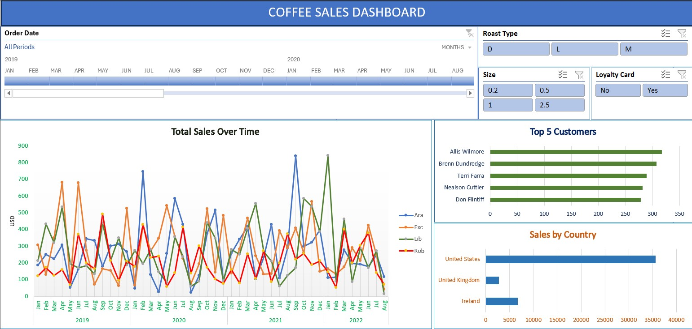
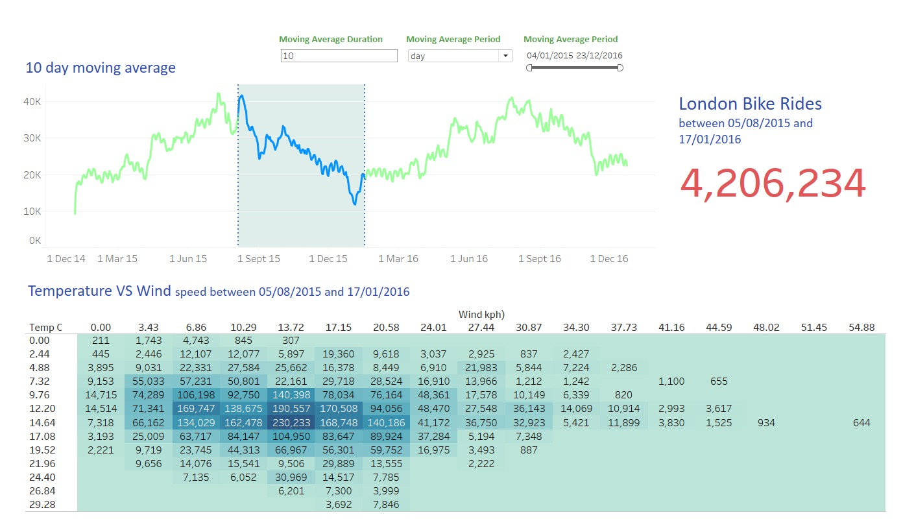
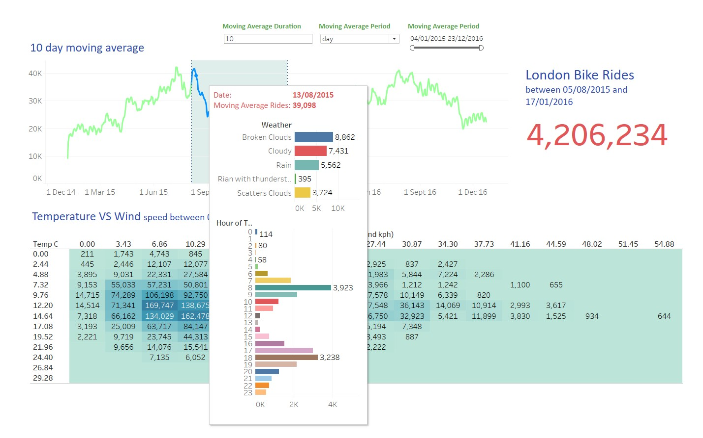
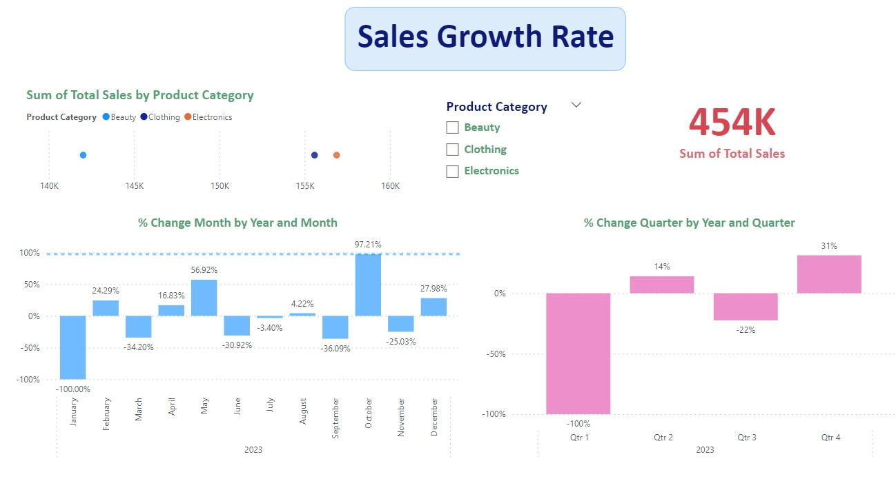
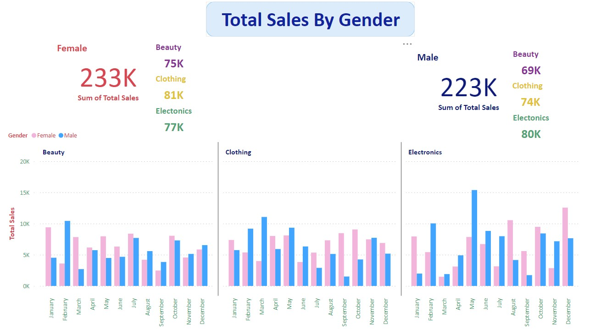
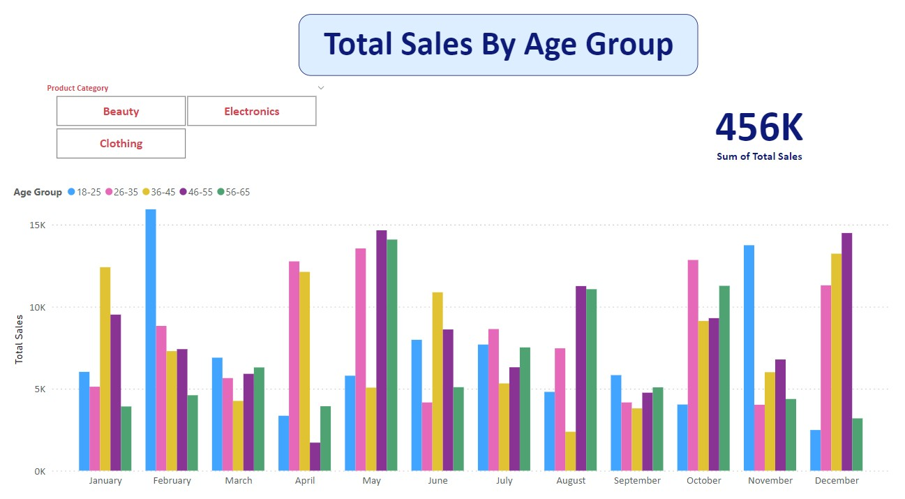
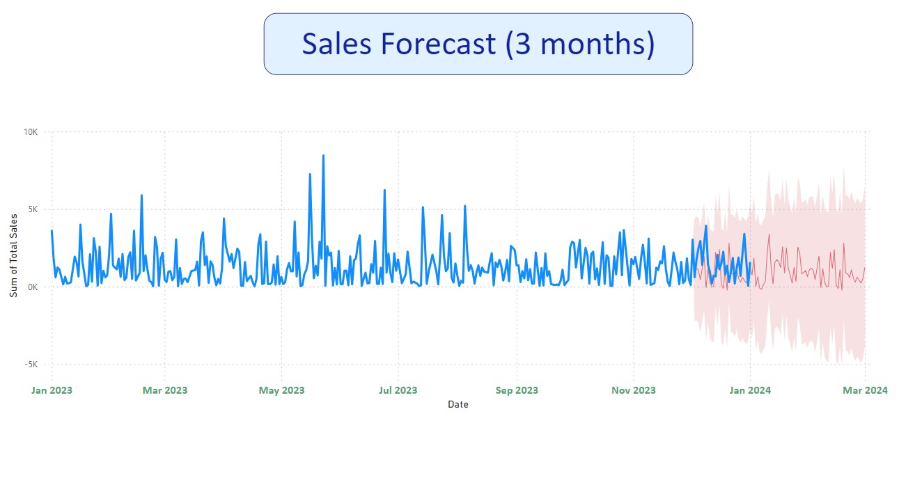

# Klaokatekan - Data Analyst Portfolio
## About

## Table of Contents 
- [About](#about)
- [Portfolio Projects](#portfolio-projects)
    - Excel 
        - [Coffee Sales data dashboard](#coffee-sales-data-dashboard)
    - Jupyter Notebook
        - [London Bike](#london-bike)
    - Power Bi
        - [Retail Sales Report](#retail-sales-report)
      

## Portfolio Projects

### Coffee Sales
**Repository:** [`CoffeeSales.xlsx`] (https://github.com/Klaokatekan/PortfolioProjects/blob/main/CoffeeSales.xlsx)

**Description:** Utilizing XLOOKUP and INDEX MATCH to gather data, followed by data manipulation using the IF function, construction of an interactive coffee sales data dashboard. This dashboard will facilitate the analysis of coffee sales trends over time and across countries by utilizing pivot tables and charts.

**Skills:** data visualization.

**Preview** 

### London Bike Sharing ###
**Repository:** [`london_bikes_data.ipynb`] (https://github.com/Klaokatekan/PortfolioProjects/blob/main/london_bikes_data.ipynb)  

**Description:** Using the Pandas library in Python to gather, explore, assess, and manipulate data thoroughly. In Tableau, we create impactful visualizations, including moving average charts and heatmaps, to reveal the relationships between temperature and wind speed.

**Preview** 

### Retail Sales Report ###
**Repository:** [`Retail Sales Report.pbix`] (https://github.com/Klaokatekan/PortfolioProjects/blob/main/Retail%20Sales%20Report.pbix)

**Description:** Utilizing Power BI, a dynamic report is created to reveal Sales Growth rates, comprehensive charts for comparative analysis by Gender and age group, and a sales forecast spanning three months with a 99% confidence interval.

**Preview** 

